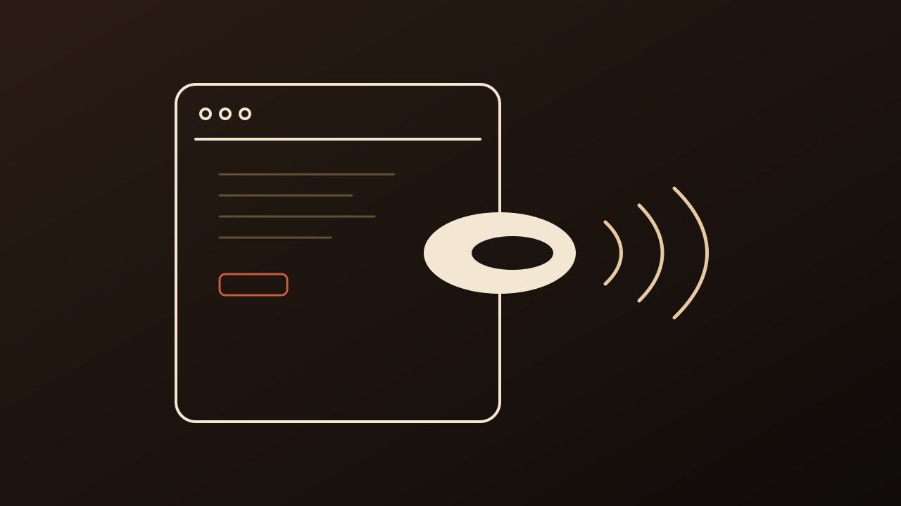
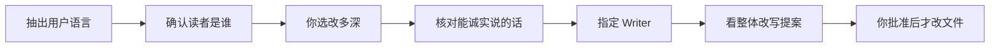
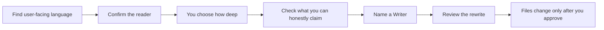

# Userese

把面向用户的话，改成读者听得懂的话。

<p align="center">
  
</p>

当前版本：v0.3.0

## 它解决什么问题

用 AI 写出来的产品、网站、介绍页，读起来常常不像说给人听的。套话和术语堆在一起，用户看不懂，但你作为开发者往往发现不了。

Userese 是给 Agent 用的内容设计 Skill。它把一个项目里面向用户的语言全部找出来，问清你希望谁来看，再按用户视角做一次整体修改。

默认只在项目的 `.userese/runs/` 里写研究和提案。产品文件先不动，也不提交、不推送、不上线。

## 适合什么时候用

- 你是一个很厉害的产品，通过vibe coding出来的结果，上线之前可以整体做一遍检查
- 你是一个很厉害的Builder，但不确定你的用户是否能看懂你的表达
- 害怕页面太多，说法大家，害怕AI味太重，但一条条改太浪费时间
- 你的coding主模型未必是适合你写文案的模型，希望用自己的writer模型整体做表达修改，又不想消耗太多writer模型的token

不适合纯视觉设计。如果读者和要说的话已经定了，只想去掉一点 AI 腔，用去 AI 味技能即可。

## 怎么跑



先找出用户会碰到的界面，以及这些界面上的字。再问你：希望谁来看。你可以选改核心表达、整页，还是整个项目。

源文件要你点头才动。你批准哪些 `copy-*` ID，才改哪些。只修改文案的话不会修改整体布局。

## 安装

需要 Python 3.10+。把仓库克隆到你的 Agent 会扫描的 skills 目录。

```bash
# Codex / Claude Code
git clone https://github.com/AsherLay/userese.git ~/.agents/skills/userese

# Cursor
git clone https://github.com/AsherLay/userese.git ~/.cursor/skills/userese
```

对话里这样启动：

```text
使用 $userese 把这个项目里面向用户的语言找出来。先确认我希望谁来看，再按这个读者视角给出整体改写提案；先不要修改源文件。
```

运行入口是 [`SKILL.md`](SKILL.md)。协议和脚本按任务按需读取。

## 可选 Writer

Userese 自己不写最终句子，除非你让当前 Agent 当 Writer。Writer 只按已经确认的读者和含义写，不重新决定这是写给谁的。两个配套 Writer 要单独安装，或者用你自己常用的writer skill

| Writer | 模型 | 说明 |
|---|---|---|
| [userese-writer-qwen3-8-flash](https://github.com/AsherLay/userese-writer-qwen3-8-flash) | 阿里云百炼 `qwen3.8-flash` | 更适合中文稿。自备 `QWEN_API_KEY` 或 `DASHSCOPE_API_KEY` |
| [userese-writer-gemini3-7-flash](https://github.com/AsherLay/userese-writer-gemini3-7-flash) | OpenRouter `google/gemini-3.7-flash` | 更适合英文稿。自备 `OPENROUTER_API_KEY`；也可以用 `ANTHROPIC_AUTH_TOKEN` 和 Claude Code 共用密钥 |

它们只消费已确认的 `userese-brief/v1`，不改产品文件。首次产生费用前会说明模型、条目数和预计批次数。

也可以自己做一个遵守同一协议的 Writer。接口见 [`references/writer-interface.md`](references/writer-interface.md)。

## 这一版做了什么

v0.3.0 先让你看清用户会读到什么、改多深，再进入写作。避免一上来把主文案和按钮、图注、技术状态搅在一起。

- 勘察卡和三种深度：核心表达、完整界面、全项目
- 按用户会碰到的界面来找字，不按某个前端文件
- 没展开的类别仍留着覆盖证据
- API、CMS、国际化和运行时内容可以追溯
- 读者、范围、Writer、提案、改文件仍然分开批准

不绑定 Playwright，不自动拿登录凭据，不写回 CMS 或数据库。登录态、后台和第三方 CMS 需要你授权后才能采集；采集不到的部分会记成覆盖限制。

## English

Turn the user-facing words into language a reader can follow.

Current version: v0.3.0

### What it is for

AI-written products, sites, and intro pages often do not sound like they were written for a person. Boilerplate and jargon pile up. Users cannot follow it. You, as the person who built it, often cannot see that.

Userese is a content-design skill for coding agents. It finds all user-facing language in a project, asks who you want to read it, then rewrites that copy from the user's point of view.

By default it only writes research and proposals under `.userese/runs/`. Product files stay untouched. No commit, push, or ship.

### When to use it

- You are a strong product person. You vibe-coded something, and you want a full pass before it goes live
- You are a strong builder, and you are not sure users can follow how you explain it
- There are too many pages, the copy contradicts itself, it sounds like AI, and fixing it line by line would take too long
- The model you code with may not be the right model for copy. You want your own writer model to redo the wording, without spending too many of that writer's tokens

Skip it for visual-only work. If the reader and the message are already set, and you only want to strip AI tone, use a de-AI skill.

### How it runs



First find the screens a user will hit, and the words on those screens. Then ask who this is for. You can rewrite the core expression, a whole screen, or the project.

Source files change only after you say so. Only approved `copy-*` IDs are edited. Changing the copy does not change the overall layout.

### Install

Python 3.10+. Clone into the skills directory your agent scans.

```bash
# Codex / Claude Code
git clone https://github.com/AsherLay/userese.git ~/.agents/skills/userese

# Cursor
git clone https://github.com/AsherLay/userese.git ~/.cursor/skills/userese
```

Work in English. Talk to the agent in English and start with:

```text
Use $userese to find the user-facing language in this project. First confirm who I want to read it, then propose a full rewrite from that reader's point of view. Do not edit source files yet.
```

The agent should follow the English stop-and-ask lines in [`references/operator-prompts-en.md`](references/operator-prompts-en.md). The run entry is still [`SKILL.md`](SKILL.md).

### Optional writers

Userese does not write the final sentences unless you make the current agent the Writer. A Writer writes to the confirmed reader and meaning. It does not decide who this is for. Install a companion Writer, or use a writer skill you already have.

- [userese-writer-qwen3-8-flash](https://github.com/AsherLay/userese-writer-qwen3-8-flash): Alibaba Cloud Model Studio `qwen3.8-flash`. Better for Chinese copy. Needs `QWEN_API_KEY` or `DASHSCOPE_API_KEY`.
- [userese-writer-gemini3-7-flash](https://github.com/AsherLay/userese-writer-gemini3-7-flash): OpenRouter `google/gemini-3.7-flash`. Better for English copy. Set `OPENROUTER_API_KEY`. `ANTHROPIC_AUTH_TOKEN` still works if you already share an OpenRouter key with Claude Code.

They consume a confirmed `userese-brief/v1` and do not edit product files. Before the first paid call they state the model, item count, and expected batch count.

You can also write a compatible Writer. See [`references/writer-interface.md`](references/writer-interface.md).

### This version

v0.3.0 shows you what a user will read, and how deep to go, before anyone writes. That keeps the main copy from being mixed with buttons, captions, and technical states.

- A scan card and three depths: core expression, full surface, whole project
- Find words by the screen a user hits, not by a frontend file
- Unexpanded categories still keep coverage evidence
- API, CMS, i18n, and runtime copy can be traced
- Reader, scope, Writer, proposals, and file edits stay as separate approvals

It does not bind Playwright, collect login credentials, or write back to a CMS or database. Signed-in, admin, and third-party CMS states need your permission to collect. What cannot be reached is recorded as a coverage limit.

## 开发

仓库根目录就是可安装的 Skill 包。改版本前读 `AGENTS.md` 和 `CONTEXT.md`。

```bash
python3 -m unittest discover -s tests -v
```

## License

[MIT](LICENSE)。版权人 `AsherLay`，2026。

可以自由使用、修改、分发和商用，包括闭源产品。复制或再分发时需要保留版权声明和许可声明。软件按原样提供，没有担保。完整条款以 `LICENSE` 文件为准。
